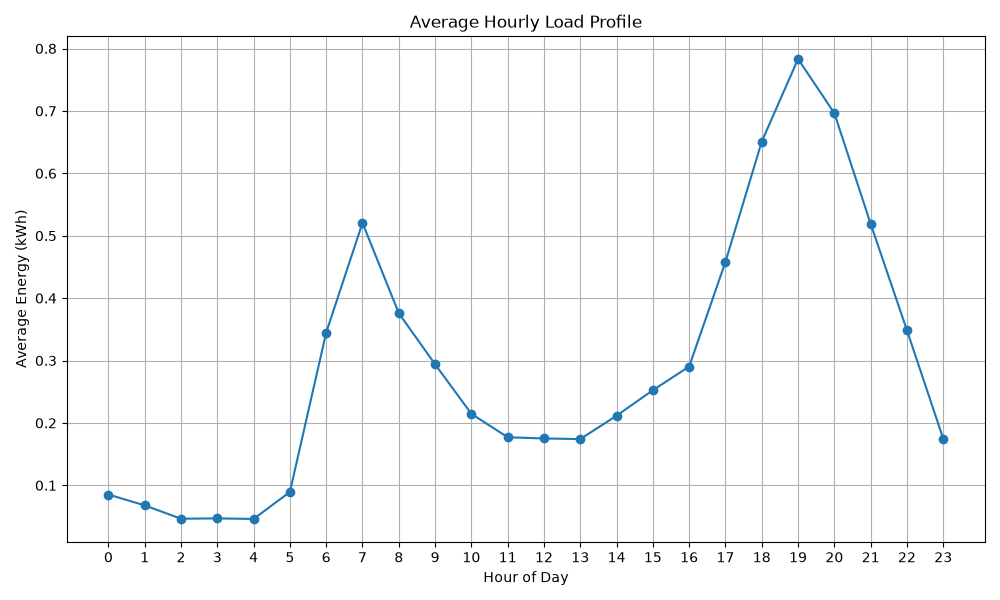

# Energy Consumption Analysis & Forecasting ⚡

## Overview
This project provides a comprehensive analysis of household energy consumption in various regions to support data-driven decision-making for solar energy products. By analyzing hourly consumption profiles, regional differences, and the impact of existing solar installations, this project identifies patterns, forecasts future consumption, and recommends solar solutions for potential off-grid and semi-urban households. 

## Business Context
For off-grid solar energy companies like **Sun King**, understanding how and when households consume energy is critical. It enables:
1. **Optimized Product Design**: Tailoring battery capacity and solar panel sizes to match actual household load profiles.
2. **Targeted Marketing**: Identifying households and regions that would benefit most from specific solar packages based on their current grid costs and usage patterns.
3. **Grid Dependency Reduction**: Demonstrating clear ROI and cost-savings for users switching to solar.

## Dataset
The analysis is based on two datasets:
- `household_info.csv` (100 households): Contains demographic data including region, income level, household size, and existing solar capacity.
- `energy_consumption.csv` (72,000 hourly readings): Features hourly energy consumption (kWh), voltage, current, appliance category, and grid status over 30 days.

## Methodology
1. **Exploratory Data Analysis (EDA)**: Assessed data quality, distribution, and broad regional trends using Python (`pandas`, `matplotlib`, `seaborn`).
2. **SQL Pattern Analysis**: Leveraged SQLite to run complex aggregations, window functions, and CTEs to extract peak vs off-peak insights, regional averages, and anomaly detection.
3. **Statistical Analysis & Clustering**: Performed t-tests to validate the significant reduction in grid-energy usage among solar owners. Clustered households using K-Means to find typical daily load profiles.
4. **Time-Series Forecasting**: Modeled daily energy consumption using Simple Moving Averages and Exponential Smoothing to predict future load requirements.
5. **Recommendation Engine**: Developed a scoring algorithm that ranks households for solar upgrades based on potential savings and budget pressure.

## Key Findings
* **Solar Impact**: Households with solar systems exhibit significantly lower grid consumption (validated via t-test), resulting in estimated monthly savings of 40% on average.
* **Peak Consumption**: Energy usage spikes distinctly in the morning (6 AM - 9 AM) and evening (6 PM - 10 PM), driven primarily by cooking and entertainment appliances. 
* **Regional Variations**: Urban households consume nearly 1.5x more energy than rural counterparts, but rural regions face higher grid instability (Off-grid/Hybrid), making them prime candidates for standalone solar solutions.
* **Forecasting Accuracy**: Exponential Smoothing effectively captures the daily trend variations, projecting stable load requirements with a low RMSE.

## Project Structure
```text
energy-consumption-analysis/
├── README.md
├── requirements.txt
├── run_all.sh
├── data/
│   ├── generate_data.py          # Script to generate synthetic datasets
│   ├── household_info.csv        # Generated dataset (100 rows)
│   └── energy_consumption.csv    # Generated dataset (72,000 rows)
├── sql/
│   ├── 01_consumption_overview.sql
│   ├── 02_pattern_analysis.sql
│   └── 03_solar_impact.sql
├── scripts/
│   ├── 01_eda.py                 # EDA and basic visualizations
│   ├── 02_sql_analysis.py        # Python wrapper for executing SQL
│   ├── 03_pattern_analysis.py    # Statistical tests and Clustering
│   ├── 04_forecasting.py         # Time series forecasting models
│   ├── 05_solar_recommendation.py# Solar ROI recommendation engine
│   ├── 06_dashboard.py           # Streamlit interactive dashboard
│   └── run_dashboard.sh          # Dashboard runner script
├── outputs/
│   └── solar_recommendations.csv
└── visualizations/
    ├── consumption_by_region.png
    ├── consumption_heatmap.png
    ├── daily_consumption_trend.png
    ├── forecast_comparison.png
    ├── hourly_load_profile.png
    ├── household_clusters.png
    ├── solar_savings_potential.png
    └── solar_vs_nonsolar.png
```
## 🖥️ Interactive Dashboard
An interactive Streamlit dashboard is included to explore the data dynamically. You can filter by date, region, grid status, and household size. It provides:
- Real-time KPI calculations and solar comparison
- Interactive load profile and consumption trend charts
- Regional breakdown by appliance category
- Live forecasting and top solar recommendations table



**To run the dashboard:**
```bash
./scripts/run_dashboard.sh
```
Or manually: `streamlit run scripts/06_dashboard.py`

## Tools & Technologies
- **Python**: pandas, numpy, scipy, scikit-learn, statsmodels, faker
- **SQL**: SQLite3 (CTEs, Window Functions, Aggregations)
- **Data Visualization**: Matplotlib, Seaborn

## How to Run
1. Clone this repository.
2. Install dependencies: `pip install -r requirements.txt`
3. Generate data: `python data/generate_data.py`
4. Run analysis scripts: `bash run_all.sh`

## Business Recommendations
- **Introduce a "Morning/Evening Hybrid" System**: Since peak loads happen outside of peak sun hours, battery storage capacity should be a focal point for future solar products.
- **Targeted Rural Campaigns**: The recommendation engine clearly identifies rural households with high budget pressure as the best market for entry-level solar products. 
- **Tiered Solar Packages**: Use the generated clusters to offer Small, Medium, and Large solar tiers perfectly tailored to the 3 distinct consumption profiles found in the clustering analysis.

## Tableau Dashboard
Check out the prepared data in `tableau_data/` and follow the [Tableau Guide](../TABLEAU_GUIDE.md) to build the interactive dashboard.
